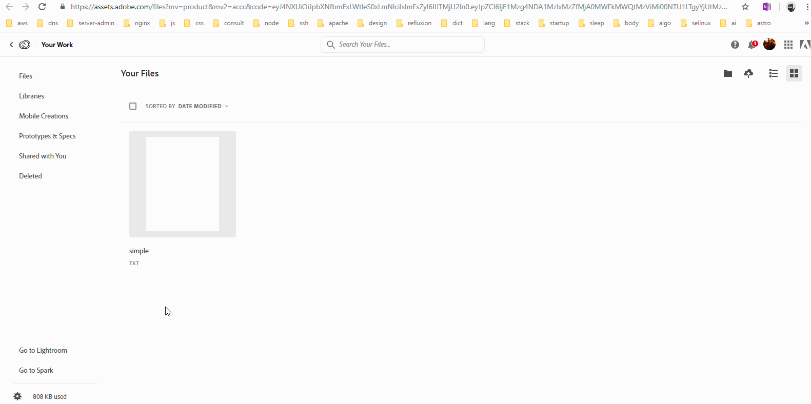

# **Creative Cloud**

## _**Creative Cloud**_ is the name for the _**suite**_ of software avaiable from Adobe. Years back, Adobe _**used to**_ offer its software suite as a _**standalone**_ installer for a fixed price. Now, with the introduction of Creative Cloud, Adobe wants to charge users for a monthly or a yearly subscription where the artwork you create could be saved in the _**cloud**_. 

## Artists and Musicians are often referred to as creative artists which is something I don't agree with. Anyone could be a creative artist in whatever they are trying to do. Anyway, the term "Creative Cloud" is a _**pun**_ on this _**notion**_. Taking this into consideration, Creative Cloud is a suite of software used by "creative artists" where the "creative assets"(artwork) could be saved safely in the _**cloud**_. 

# **Experiment**

### **1.** When you install any software from the Creative Cloud suite for the first time, Adobe installs the Creative Cloud app. The Creative Cloud app lets you install all the Adobe software products in one place. Take a look at all the software products currently available here: 

### https://www.adobe.com/products/catalog.html. 

### Enter the names of the products that has the below functionalities into "master.md":

### 1. The product that creates beautiful vector arts and illustrations 

### 2. The product that lets you design, prototype and share user experiences. 

### 3. The product that creates graphics, web pages and video stories in minutes. 

### The below gif shows the Creative Cloud app. 

### **2.** On the Creative Cloud(CC) app, you will find some tabs: Apps, Learn, Assets and Behance. We will take a look at some of the tabs in this pilot starting with Learn. You can find a lot of tutorials and sample files that you can play with here. We will use these tutorials and sample files in later pilots. 

### **3.** Take a look at the Assets tab. This tab should help you if you still don't understand the "cloud" in creative cloud. You should see three tabs under it: Files, Fonts and Market.

### **4.** In the Files tab, you can see all the files that you might have saved on the cloud. Click on "Open Folder" to open up the "Creative Cloud Files" folder in your computer. Whenever you put files into this "Creative Cloud Files" folder, the files are automatically uploaded to the Cloud. To see for yourself, add a simple text file to this folder. When the file is uploaded, you should see a tick next to the file icon. 

### **5.** Now go back to the CC app, click on "view on web" button under the Files tab inside Assets tab. You should see a webpage popup. This is the cloud where the "creative assets" you had put inside the "Creative Cloud Files" folder is getting uploaded into. 

### **6.** Adobe's creative cloud currently keeps all the files you would upload in the cloud computing service offered by Microsoft Azure. To start with, Adobe gives a free file storage of upto 2 GB for every user. We will take a look at the other tabs in later pilots.  

## **Reference**

## [WIKI]()

### **Source:** https://en.wikipedia.org/wiki/Adobe_Creative_Cloud
