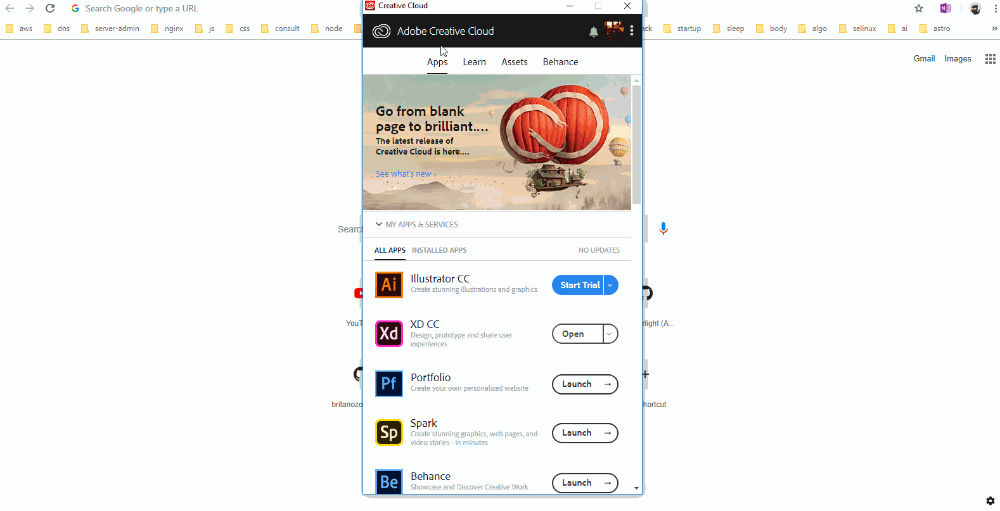

# **Behance**

## Behance is a _**portfolio**_ website where "creative artists" can showcase their artwork. It is owned by Adobe so you don't have to sign up for it if you already have an Adobe ID that you use with your creative cloud. 

# **Experiment**

### **1.** Take a look at the website and have a look around: 

### https://www.behance.net/

### Behance is a great place to look for inspiration as you design your product. 

### You can sign in with your Adobe ID to showcase your artwork. 

### **2.** There's a better way to sign in into Behance. Adobe owns Behance so it has made things easy for you to sign in into Behance. Open up CC app. Look for Behance under the Apps tab and launch it. The Behance website opens up signed in with the Adobe ID that you use with your creative cloud so you don't have to sign in into Behance website every time, just sign in to CC app and launch Behance. 

## **Reference**

## [Behance]()

### **Source:** https://help.behance.net/hc/en-us

