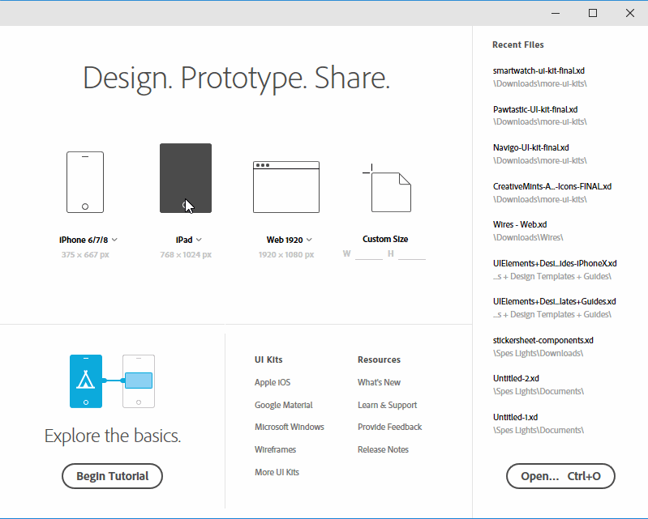
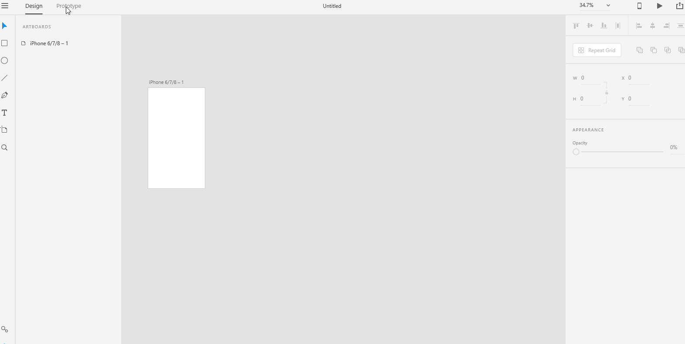
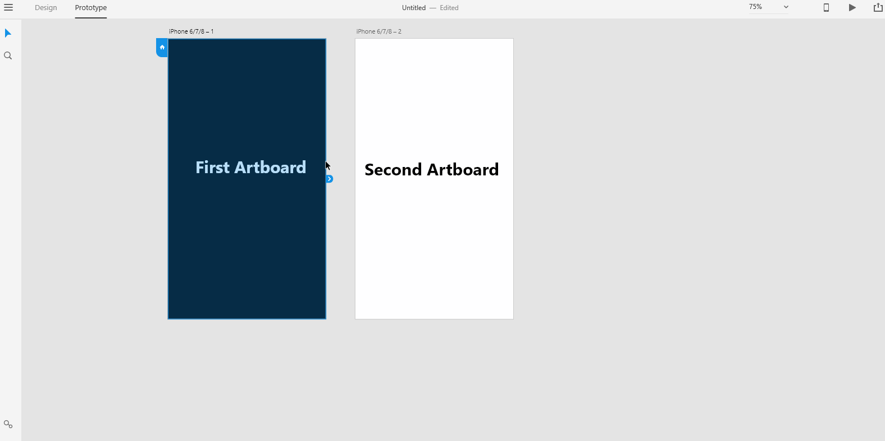
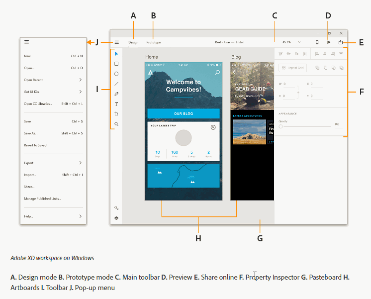

# **Basics**

## Adobe XD is an UX(**U**ser e**X**perience) prototyping software. Designing the experience of your user should be the first step before you design a new product(software or website or app). You would want get into the minds of the product's users as much as possible and design the product _**putting yourself in their shoes**_.  

# **Experiment**

### **1.** In this pilot, we want to get a very high level view of Adobe XD's general workflow. The general workflow could be described with the following steps: 

- ### Design
- ### Prototype
- ### Share

### **2.** When you launch Adobe XD and the start screen appears, you can select a preset(such as IPhone, IPad or Web) size or a custom size for your artboard. 

### **3.** After you select a size for your artboard, the Adobe XD workspace window appears. You can switch between Design and Prototype modes by clicking between the two tabs found at the top. Create a xd project named "custom". Select a custom size of your choice to get a feel for it. 

 

### **4.** On Design mode, your typical workflow would be:

- ### You would import external assets from other design softwares such as Adobe Illustrator, Adobe Photoshop or Sketch to use in Adobe XD. 

- ### You would create your own asset right there in Adobe XD or you would enhance the asset you've created in another design software. It is advised that you enhance(make better or make final touches on) your asset rather than create any asset in Adobe XD itself. The reason is, because Adobe XD is not mature enough to offer all the functionality you might get in a mature vector graphics software such as Adobe Illustrator which offers a lot of functionality.

- ### You would create repeating elements using repeat-grid tool instead of manually recreating elements saving time. 

- ### You would add additional artboards according to your design needs. 

### **5.** On Prototype mode, your typical workflow would be:

- ### You would link your artboards. Click on the right arrow and a wire appears. Just connect this wire to the artboard you want to transition into. A popup window lets you specify the transition, duration and easing. Once you've wired the artboards, you can run the prototype by clicking on the preview button at the top right corner. 

- ### As of now, recording prototypes does not work in Windows.

### **6.** Finally, you can share the prototype either by using the publish button next to preview button or you can save the XD file and share that file instead. We typically won't use the publish button for various reasons. 

### **7.** Take a good look at the workspace overview here: https://helpx.adobe.com/xd/help/workspace-basics.html. Here's the labeled areas of the workspace below that is worth looking at, I want you to be able to refer this picture when I refer to the different areas of the workspace. For example, if I refer to **Pasteborad**, I want you to be able to look at the picture below to see what area we refer to as **Pasteboard**: 

.

## **Reference**

## [Adobe XD Guide]()

### **Source:** https://helpx.adobe.com/xd/help/adobe-xd-overview.html
