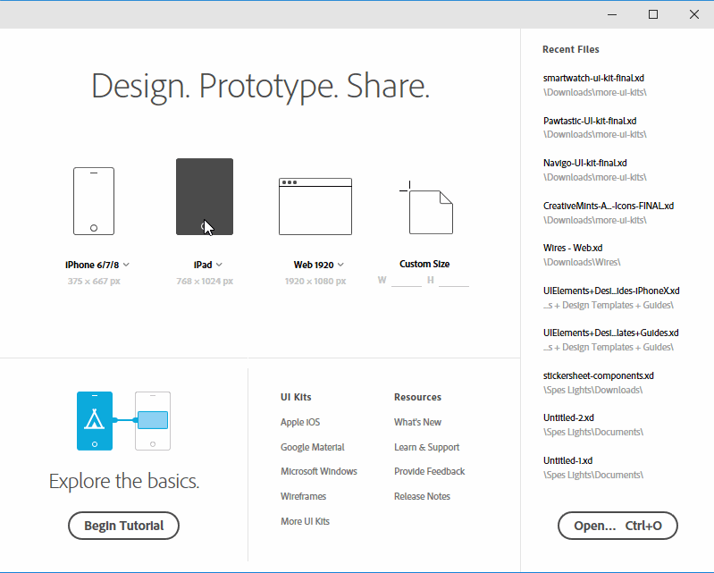
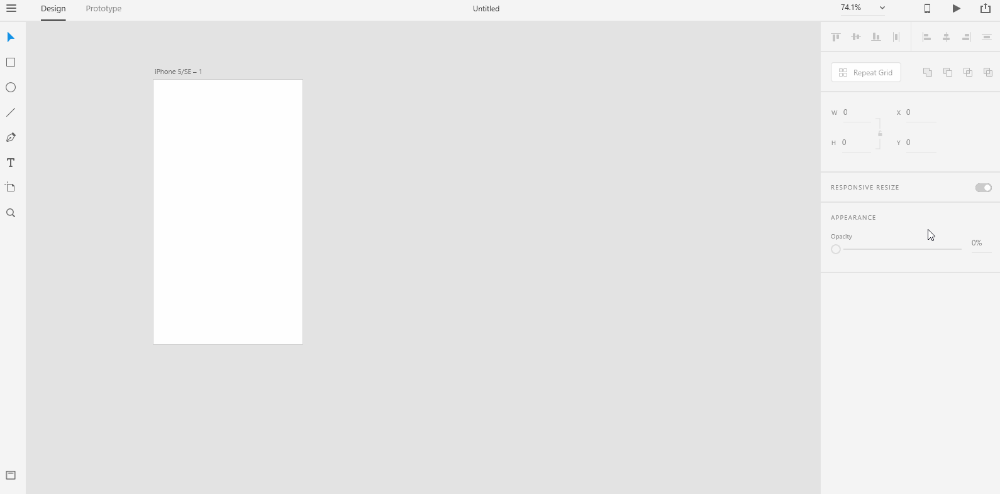

# **Create Artboards**

## Whenever you design the user experience of a product, you would want to think of making a movie with a _**kickass**_ story. The experience that the product offers to the _**end user**_ should be similar to the experience of watching a good movie where the scenes are carefully _**put together**_ by the director and the editor. 

## _**Along the same line**_, we want to create an user experience that flows like a great movie as the end user uses the product. As UX designers, we would spend most of our time creating scenes just like a movie director. In UX design, when we create an artboard we essentially mean we're creating a scene for our UX movie. Sometimes, we refer to the artboards as storyboards or sceneboards for this very reason. 

## This _**analogy**_ of user experience design with that of a movie experience is so widely used in many design studios. The analogy is being used so much so that some design studios actually call the UX prototypes as stories. UX designers create good stories for the end user. What kind of story are the end user going to experience when they use the product? What kind of story are the end user going to tell their friends and family when they use the product?  UX designers answer those questions when they design a product.  

# **Experiment**

### **1.** Artboards are scenes in an UX story. As you launch Adobe XD, you would be asked for the kind of device that you want to create your UX story for. As of now, you would get an option for "Mobile", "Web", "Tablet" and "Custom Size". The size of the device screen determines the size of your artboards.  

### **2.** When you select a size from one of the _**presets**_ or you select a custom size, the Adobe XD workspace windows opens up. Then you would see a single artboard with the size you had selected. To create additional artboards, look for the artboard tool on the **Toolbar**. Click on the artboard tool to select it. Now everytime you click on the **Pasteboard**, a new artboard is created for you. 

### You can create arboards horizontally or vertically. Shadow the below gif as a project named "art-direction". 

### **3.** In any XD project, when you create artboards using the artboard icon, the size of the artboards are preconfigured by XD to use the size you had selected in the welcome screen. Rarely, you would want to add an artboard of a different size. To do so, click on the artboard tool on the **Toolbar**.  The **Toolbar** on the right should show you all the device sizes available for you to use. Click on the device of your choice. Click on the **Pasteboard** to create an artboard of a different size. 

## **Reference**

## [Adobe XD Guide]()

### **Source:** https://helpx.adobe.com/xd/help/artboards-grids.html
