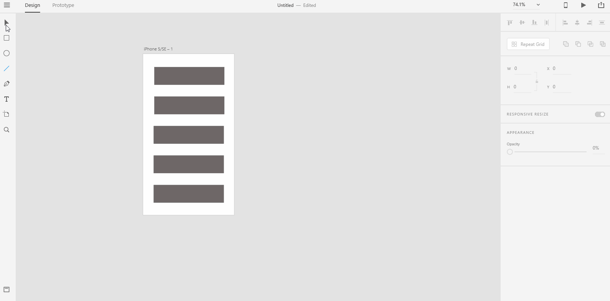
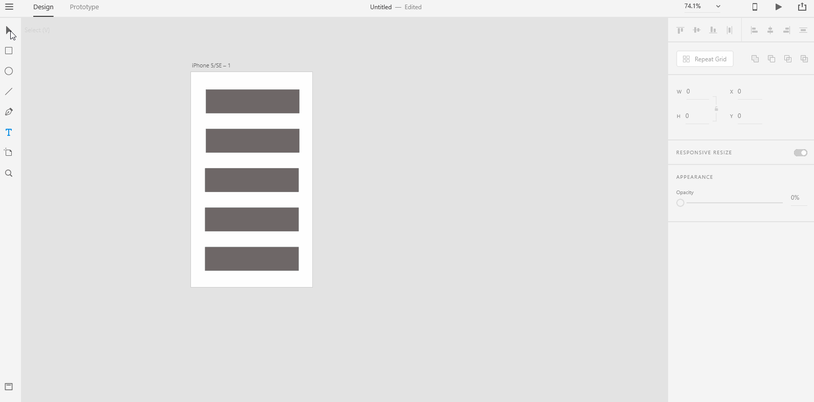
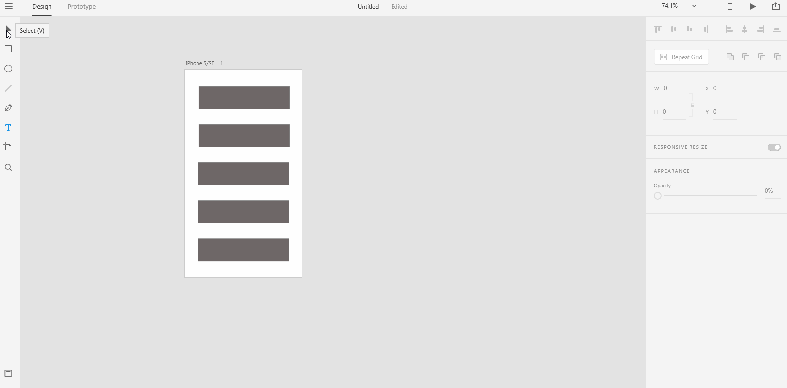

# **Select Artboard**

# **Experiment**

### **1.** To select an artboard, you first need to select the selection tool from the **Toolbar** on the left. 

### **2.** You can either do one of the following actions below to select an artboard: 

- ### Click on the artboard title to select the artboard. This is the recommended way to select an artboard. 

- ### Double click on the artboard's background to select the artboard. This method is not recommended because it gets harder to accurately click on the background as the artboard becomes complex in the later stage.  

## **Reference**

## [Adobe XD Guide]()

### **Source:** https://helpx.adobe.com/xd/help/artboards-grids.html
