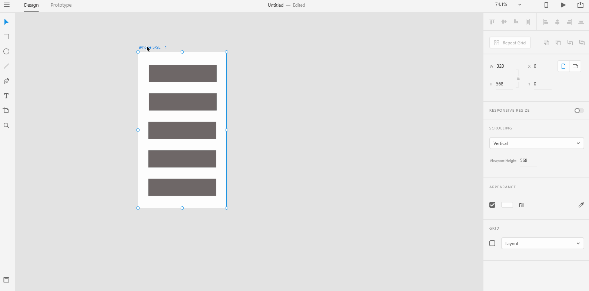

# **Scrollable Artboards**

##  We saw how artboards are considered as a scene in an UX story. Sometimes, the scenes that you are creating for a product needs scrollable content. XD allows you to create scrollable content relatively easy enough. You really need to understand one concept well enough to use scrollable artboards. **Viewport Height** represents the height of the device screen. For example, the device height might be 6 inches but the viewport height might be just 5.5 inches. This means, you can see content in the device screen for about 5.5 inches in height. Beyond that, you need to scroll your screen down to see the entire content.   

# **Experiment**

### **1.** To create a scrollable artboard, **select the artboard** first. You should see a resize handle(a small circle) around the artboard.

### **2.** 

### **3.**

## **Reference**

## [Adobe XD Guide]()

### **Source:** https://helpx.adobe.com/xd/help/artboards-grids.html
