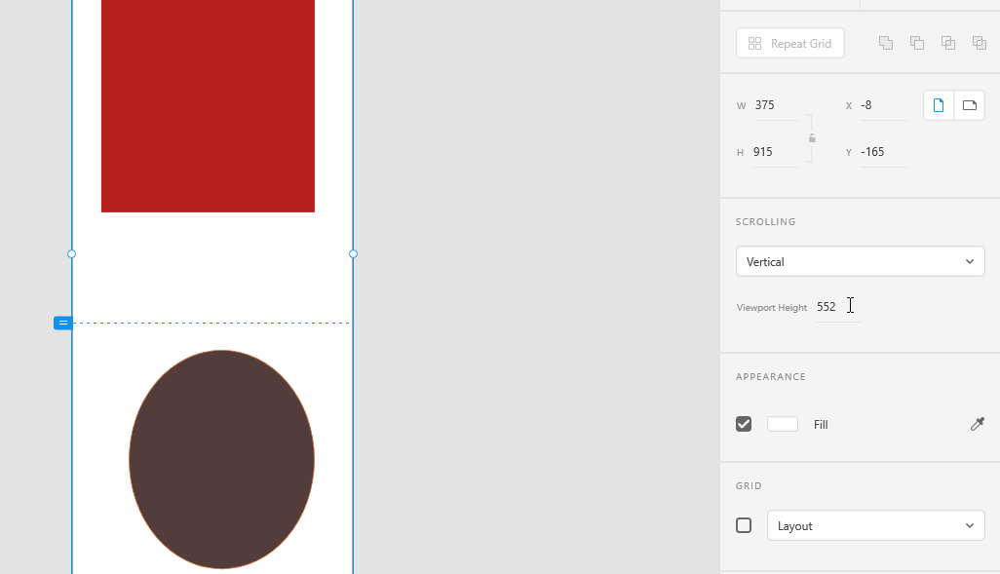

# **Scrollable Artboards**

1. ###You can create artboards that are scrollable with a vertical scroll bar.Also, specify a Viewport Height, which is the size of the window through which the artboard is viewed. The viewport height must be less than the height of the artboard for the scroll to appear. You can also specify the viewport height by moving the head of the dotted line on the canvas to the required position. 