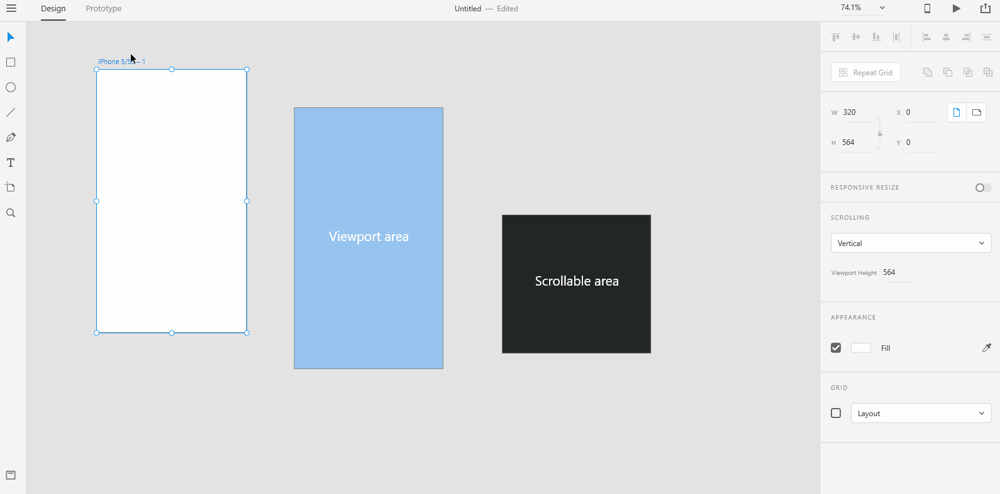

# **Scrollable Artboards**

##  We saw how artboards are considered as a scene in an UX story. Sometimes, the scenes that you are creating for a product needs scrollable content. XD allows you to create scrollable content relatively easy enough. 

## You only need to understand one concept well enough to use scrollable artboards. **Viewport Height** represents the height of the device screen. For example, the device height might be 6 inches but the viewport height might be just 5.5 inches. In other words,the height of the display screen. This just means that you can see content in the device screen for about 5.5 inches in height. Beyond that, you need to scroll your screen down to see the entire content.   

# **Experiment**

### **1.** To create a scrollable artboard, **select the artboard** first. You should see a resize handle(a small circle) around the artboard. As the name suggests, you can adjust the small circle to resize the artboard. 

### **2.** Look for the bottom resize handle and drag it down until you see a dotted line. The device's viewport height ends at this dotted line. Beyond this dotted line, all the content you create is visible only if you scroll down. Shadow the below gif into a project named "scrollable". 

## **Reference**

## [Adobe XD Guide]()

### **Source:** https://helpx.adobe.com/xd/help/artboards-grids.html
