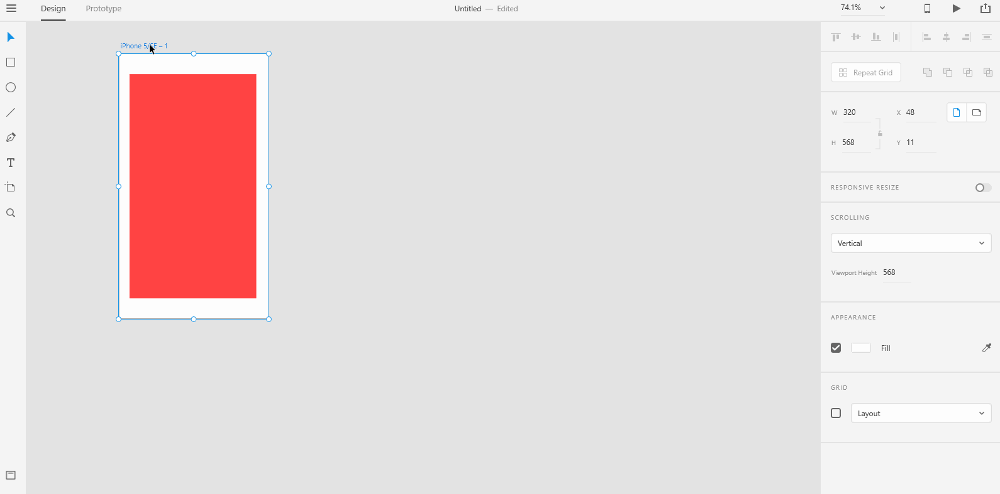

# **Copy Artboard**

# **Experiment**

### **1.** Sometimes, the scenes(artboards) you create with XD would differ from one another not by a lot. In such cases, you would want to copy the artboard and work on the little change instead of creating a new artboard and _**start from scratch**_. To copy an artboard, you first need to **select the artboard** by clicking on the artboard's title. Then simulataneously while clicking on the artboard's title, hold down the **Alt** key and drag the artboard.You should see a copy of the artboard come up, leave the new copy of the artboard anywhere you want in the **Pasteboard** to start work on the little change that you want to add. Shadow the below gif into a project named "copy-artboard".  

 

## **Reference**

## [Adobe XD Guide]()

### **Source:** https://helpx.adobe.com/xd/help/artboards-grids.html
