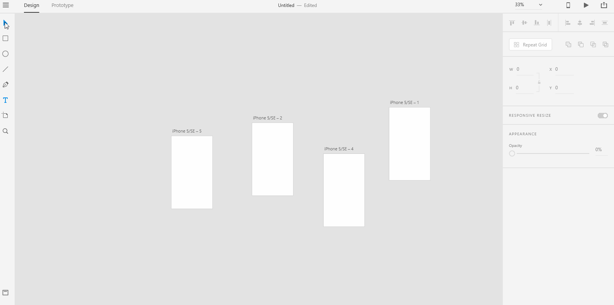
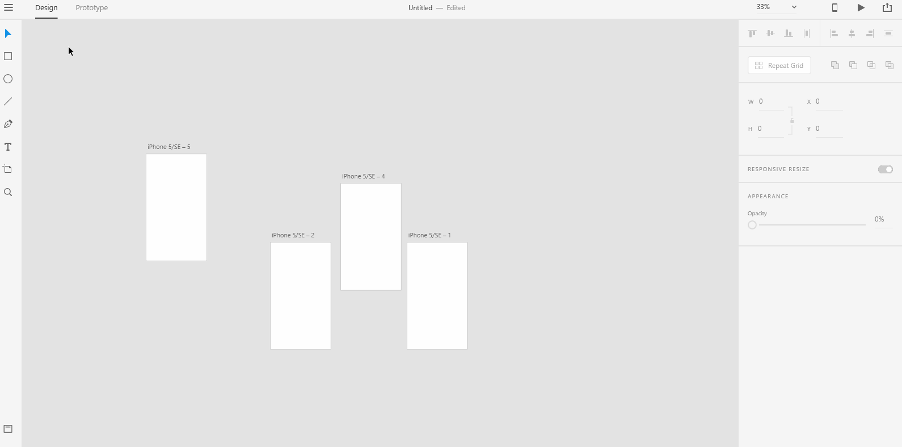
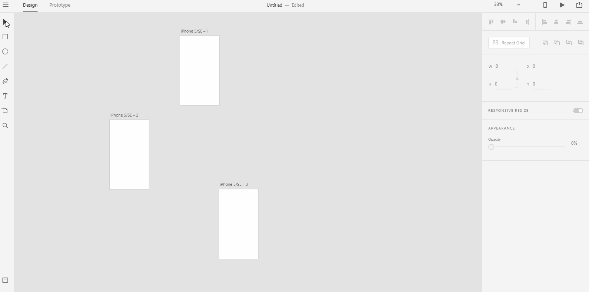

# **Align and Distribute Artboard**

# **Experiment**

### **1.** As you create more and more artboards for your UX story, your artboards might look clumsy and _**out of place**_. You need to use the **align and distribute** options in the **Property Inspector** to _**tidy up**_ your artboards. The below gif shows all the **align and distribute** options available in the **Property Inspector**. 

### **2.** Before you could use any **align and distribute** options, you need to marquee-select multiple artboards. When we say marquee-select, we want you to select multiple graphic objects simultaneously. Here, we marquee-select multiple artboards. To marquee-select multiple artboards, you need to select the "Select" tool from the left **toolbar** and create a select box around the multiple artboards. 

### **3.** To align and distribute the artboards horizontally, use the **align and distribute** options in the **Property Inspector**. We will use "Align Top" and "Distribute Horizontally" options as an example in the below gif. The "Align-Top" options aligns all the artboards that are out of place from the top. The "Distribute Horizontally" option distributes the artboards with equal space in between them. Shadow the below gif into a project named "horizontal". 

### **4.** Just as we horizontally aligned and distributed the artboards, we can use "Align Left" and "Distribute Vertically" options to align and distribute the artboards vertically. Shadow the below gif into a project named "vertical".

## **Reference**

## [Adobe XD Guide]()

### **Source:** https://helpx.adobe.com/xd/help/artboards-grids.html
