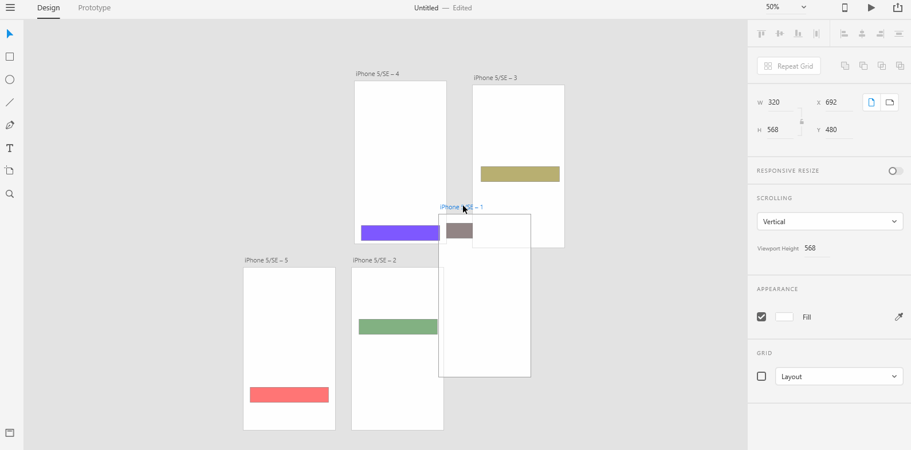

# **Rearrange Artboard**

# **Experiment**

### **1.** When you create a lot of artboards and start to prototype, your **Pasteboard** might look a little complex. You would want to rearrange the artboards so that you can keep your **Pasteboard** clean and _**clutter-free**_. To rearrage an artboard, click on the artboard's title and rearrange the artboard to a new location on the **Pasteboard**. Shadow the below gif into a project named "rearrange". 

## **Reference**

## [Adobe XD Guide]()

### **Source:** https://helpx.adobe.com/xd/help/artboards-grids.html
