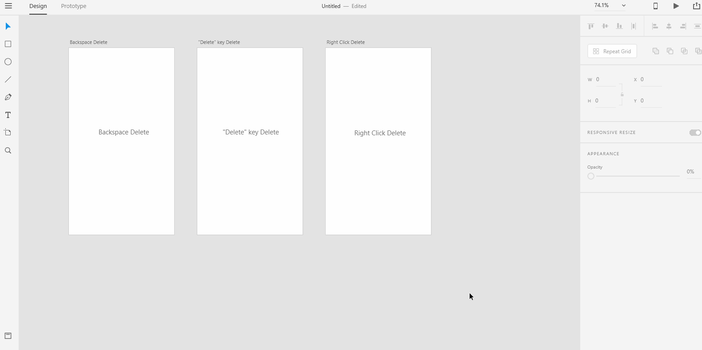

# **Delete Artboard**

# **Experiment**

### **1.** There are multiple ways to delete an artboard. We will take a look at all the options.

### To delete an artboard, the fastest way is to **select the artboard**. Then press the "backspace" key. 

### You could also delete an artboard by pressing the "delete" key though it's not nessarily the fastest way since "backspace" key is more accessible in many computer keyboards than "delete" key. 

### The slowest way to delete an artboard is to right click on the artboard and click "delete". 

### Enter the artboard titles in the above gif into "master.md". 

## **Reference**

## [Adobe XD Guide]()

### **Source:** https://helpx.adobe.com/xd/help/artboards-grids.html
