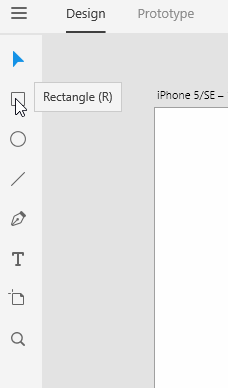
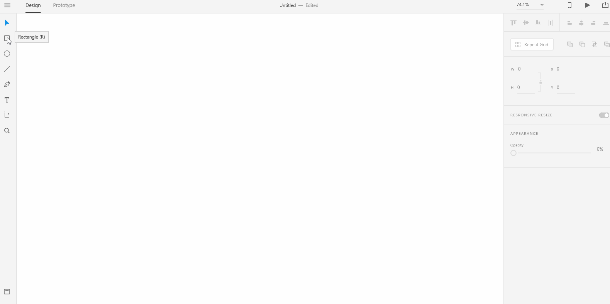
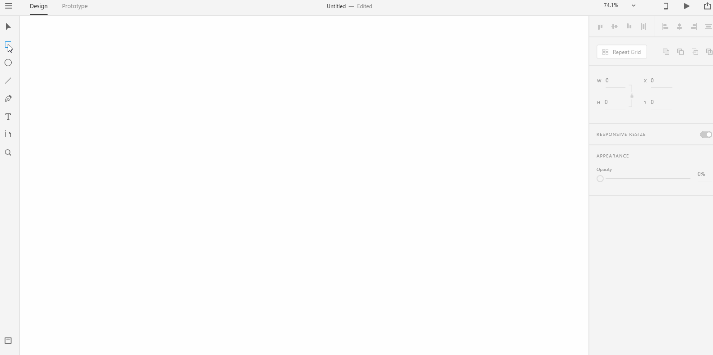
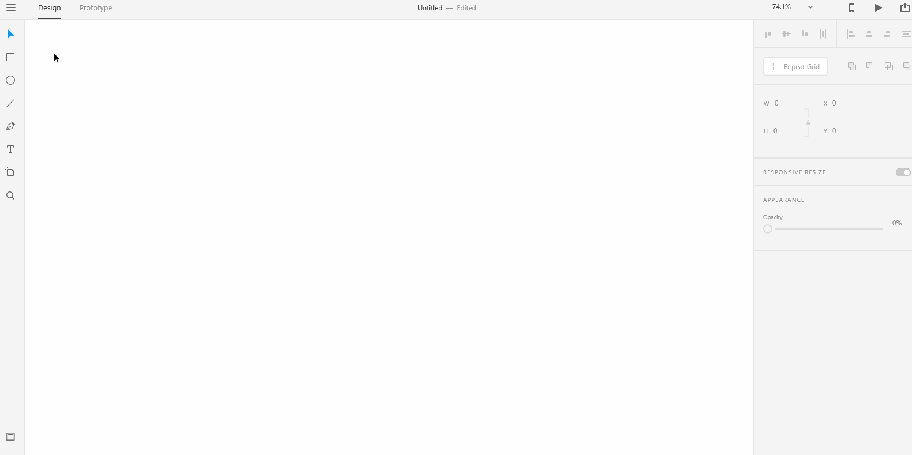
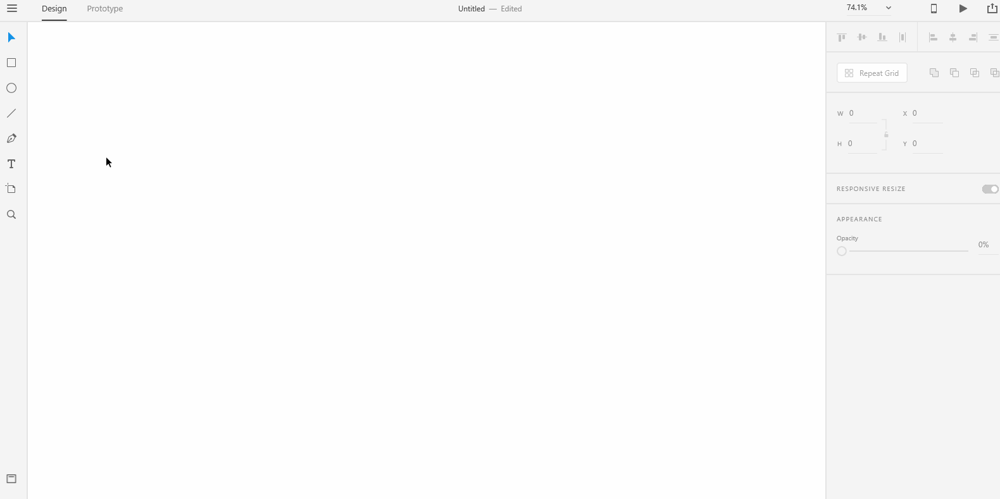
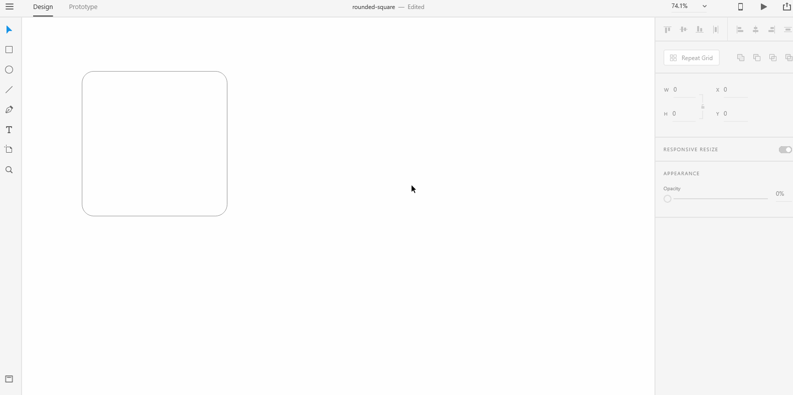

# **Drawing Tools - Rectangle**

## Adobe XD provides a number of drawing tools to create just about any shapes that you would want. 

# **Experiment**

### **1.** The drawing tools for Adobe Xd are found on the left toolbar - Rectangle, Line, Circle and Pen tools. These tools can be combined to create interesting shapes.

### **2.** To draw a rectangle, click on the "Rectangle" tool on the left toolbar. Then, drag diagonally until you see the desired size. Shadow the below gif into a xd file named "rectangle". 

### To draw a square, click on the "Rectangle" tool on the left toolbar. Then, hold down the **shift** key and drag diagonally until you see the desired size. Shadow the below gif into a xd file named "square.gif".

### **3.** To create rounded borders for rectangle and square shapes, you need to draw the shapes first. Then, look for the resize handle along the corners of the shape. Hold down one of the resize handle and drag to the center. You should see the corner start to get rounded as you move the resize handle to the center. Shadow the below gifs into a xd file named "rounded-rectangle" and "rounded-square" respectively. 

### Hold down the alt key to round a single corner only. 

### **4.**  You can also round the shapes by typing in the radii values for the corners in the **Property Inspector** on the right. Make sure that you type in the radius value and press enter otherwise the resize wouldn't work. 

## **Reference**

## [Adobe XD Guide]()

### **Source:** https://helpx.adobe.com/xd/help/drawing-text-tools.html

