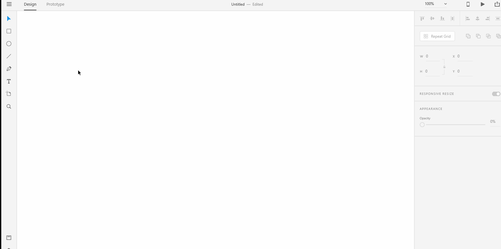
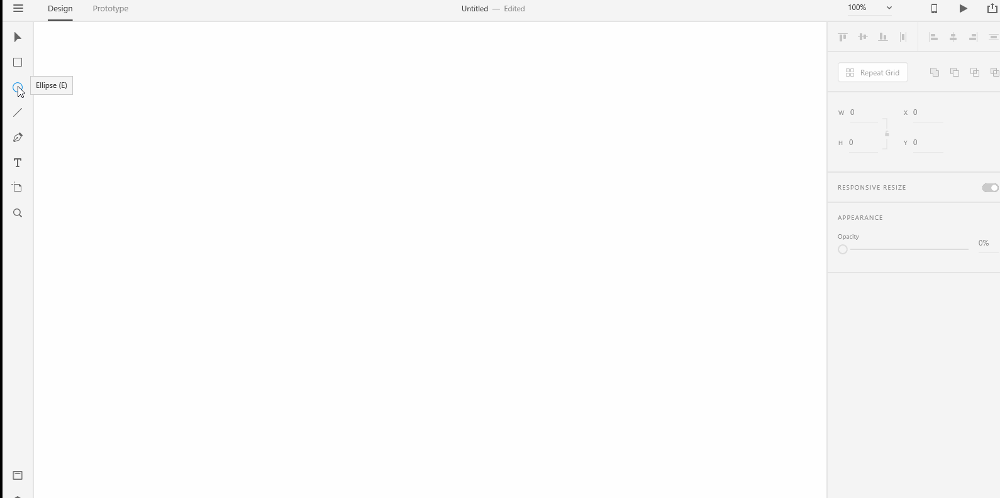

# **Drawing Tools - Ellipse** 

# **Experiment**

### **1.** Look for the "Ellipse" tool from the drawing tools on the left toolbar. Select the "ellipse" tool. Click anywhere on the **Artboard** and drag diagonally until you see an ellipse of your desire. Shadow the below gif into a xd file named "ellipse". 

### **2.** To create a circle, click on the "ellipse" tool again but this time hold down the **shift** key and drag diagonally. Shadow the below gif into a xd file named "circle". 

## **Reference**

## [Adobe XD Guide]()

### **Source:** https://helpx.adobe.com/xd/help/drawing-text-tools.html

