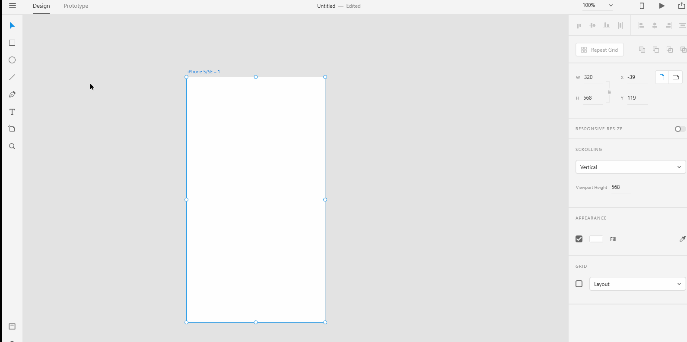

# **Drawing Tools - Line** 

# **Experiment**

### **1.** You can find the "line" tool from the drawing tools on the left toolbar. Select the "line" tool. Click anywhere on the **Artboard** and drag to the position of your desire. 

### **2** After you create a line, you can extend or shorten the line if you want to. Look for the "resize handles" on the endpoints. Move the "resize handle" to a different position on the **Artboard**.

### **3.** If you want to always draw a straight line, hold down the **shift** key when you drag the line. Shadow the below gif into a xd file named "straight-line".

## **Reference**

## [Adobe XD Guide]()

### **Source:** https://helpx.adobe.com/xd/help/drawing-text-tools.html

