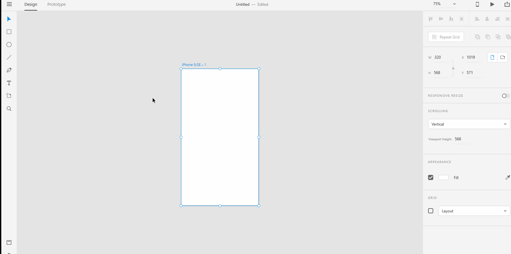
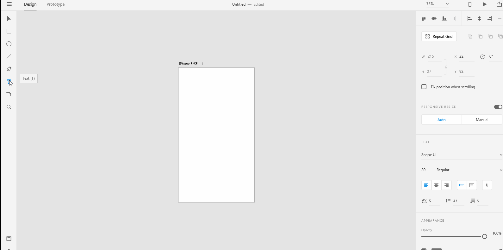
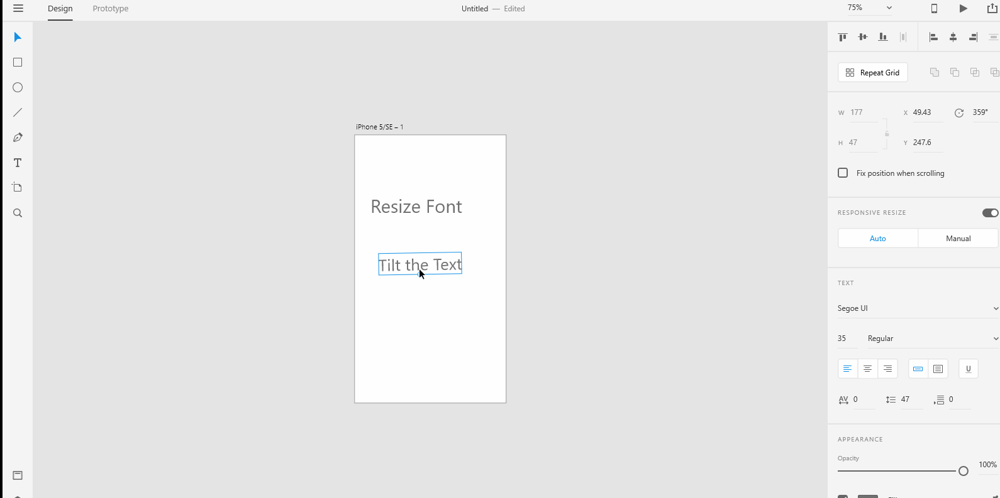
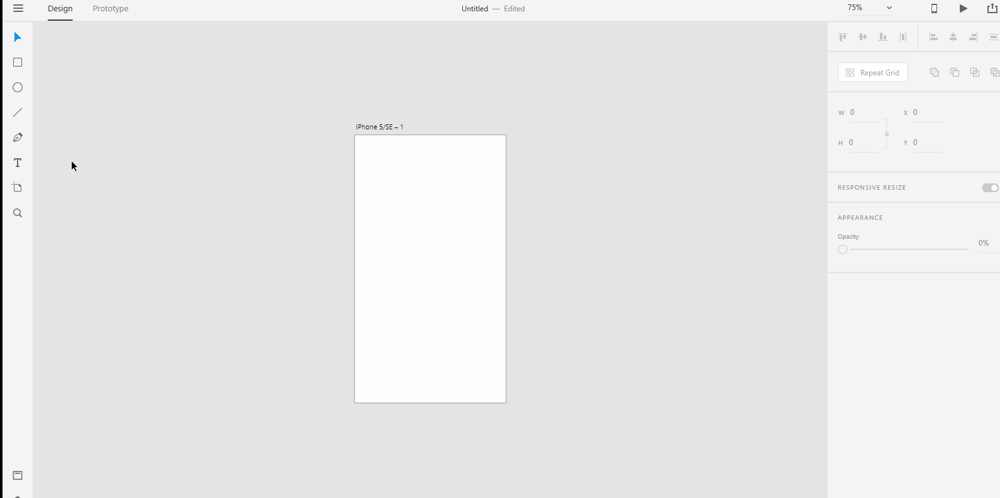

# **Text Tools - Point Text** 

## Your UX design is inevitably going to have text written over your shapes. In Adobe XD, there are two kinds of texts that you can opt to use - Point Text and Area Text. We are going to take a good look at **Point Text** now. 

# **Experiment**

### **1.** Creating point text is relatively simple. You just need to select the "text" tool from the drawing tools on the left toolbar. Then, click at a point in your artboard and start typing in the text of your choice. 

### **2.** Point texts are mostly used to create just a few words. As soon as you type in the words that you want, press the **escape** key to see the resize handle. If you want to edit the text again, you need to click on the text again. Shadow the below gif into a xd file named "esc". 

### **3.** Once you've hit the escape key and had seen the resize handle, you can move the resize handle to increase or decrease the font size. You can also rotate the text if you wanted. Shadow the below gif into a xd file named "resize-tilt". 

### **4.** As mentioned earlier, point texts are usually used to create just a few words. On the off chance if you wanted to create a line below, all you gotta do is to select the "text" tool, point at a location, type in the text but don't press "escape" key yet. Instead, press the "enter" key to go to the next line starting at the bottom of the initial location where you had clicked at the artboard. Shadow the below gif into a xd file named "next".

## **Reference**

## [Adobe XD Guide]()

### **Source:** https://helpx.adobe.com/xd/help/drawing-text-tools.html

