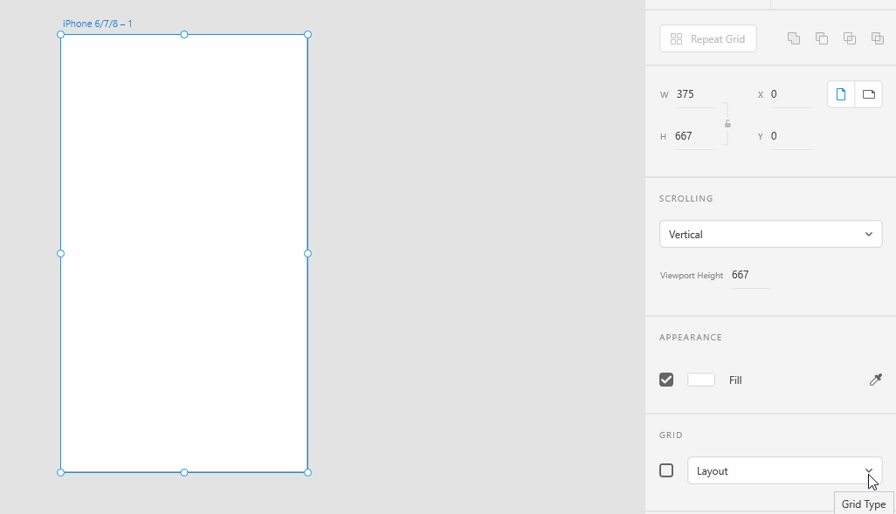
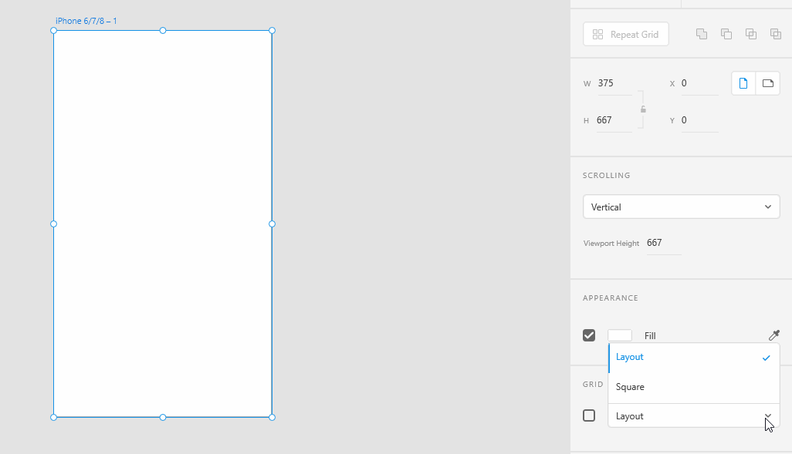

# **Position elements using grid**

## Adobe XD Provides you Two types of Grids..They are 1.Square Grid and 2.Layout Grid

# **Show Square Grid**

1. ### For this Square Grid, First we have to select the grid option in right bottom corner of an artboard.In that we have to choose the option as square grid.                                              

# **Show Layout Grid**

1. ### For this Layout Grid, First we have to select the grid option in right bottom corner of an artboard.In that we have to choose the option as Layout grid. 
