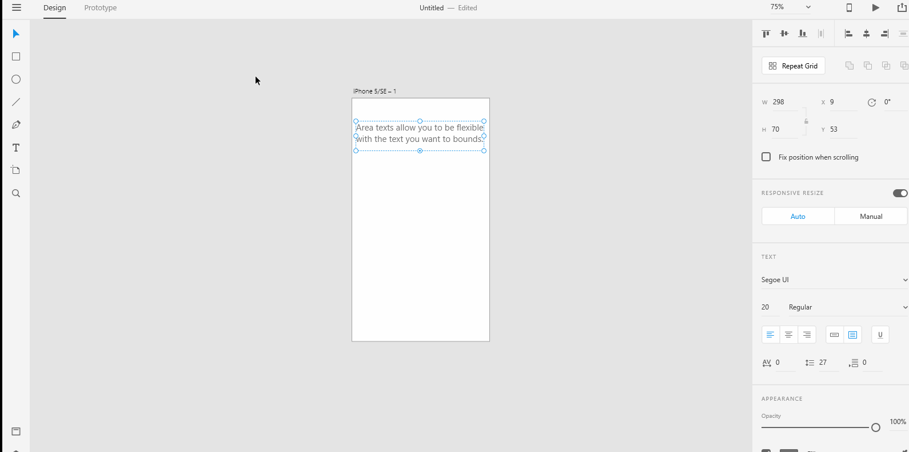

# **Text Tools - Area Text** 

# **Experiment**

### **1.** Area texts are usually used when you want to create paragraphs. To create an area text, select the "text" tool from the drawing tools on the left toolbar. Click at an initial point and start dragging diagonally until you create a shape where you want to fit your text in. Shadow the below gif into a xd file named "area-text".

### **2.**  You can resize and rotate the "area text" just as you did with the "point text". Shadow the below gifs into a xd file named "resize" and "rotate".

### **Resize**

### **Rotate**

### **3.** You can easily switch between the **Point Text** and **Area Text** from the **Property Inspector** on the right. 

## **Reference**

## [Adobe XD Guide]()

### **Source:** https://helpx.adobe.com/xd/help/drawing-text-tools.html

