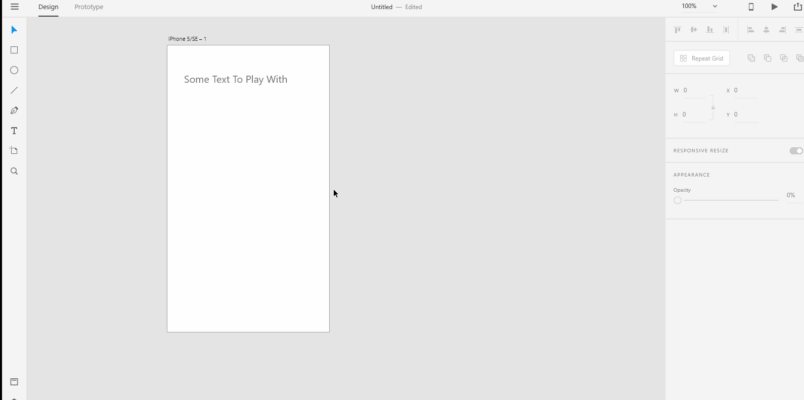
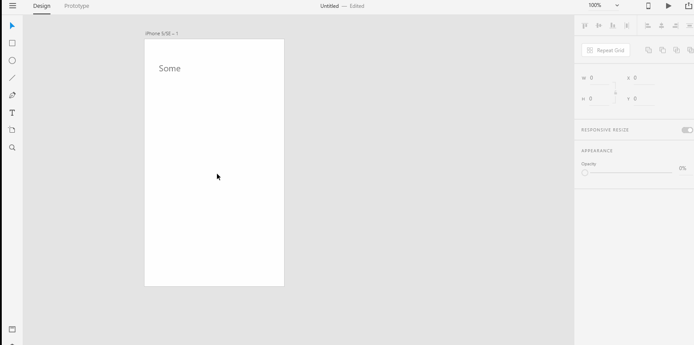
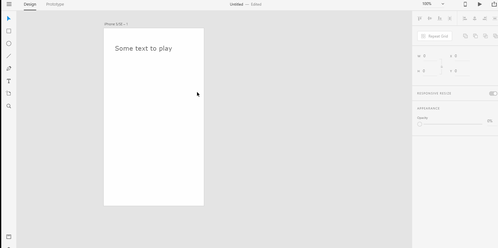
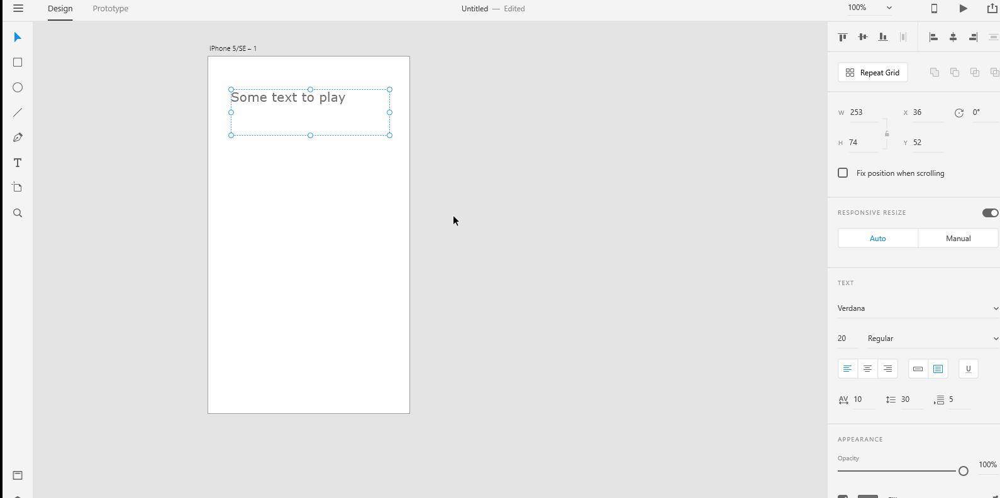

# **Text Tools - Format Text** 

# **Experiment**

### **1.** To format text in Adobe Xd, you first need to create either "point text" or "area text". Then, select the text and look for the various formatting options in the **Property Inspector** on the right: Font, Font Weight, Font Size, Text Align, Underline, Character Spacing, Line Spacing and Paragraph Spacing.

### **2.** Before you try to format any text, you need to make sure you have selected the text first. It doesn't matter whether you change the Font Size or you add Line Spacing or Character Spacing or Paragraph Spacing, you need to always press the "Enter" key when you are giving a value. For example, in the below gif, you can see that we change the font size from "20" to "60". The font size doesn't change _**right away**_ as soon as we give a new value. The change takes place only when you press the "enter" key, you can't just enter the new font size and think that it will change the old font size value, you need to press the "enter" key for the effect to work. Shadow the below gif into a xd file named "example-formatting" to _**get a feel for**_ this.

### **3.** You can either press the "enter" key as in the above experiment or you can just click on the **Pasteboard** or any **Artboards** to change the value. In the below gif, we change the font size from "20" to "40". We don't press "enter" here, we just click on the **Pasteboard** for the change to take place. Then we also change the font size from "40" to "20" but this time we just click on the **Artboard** for the change to take place. Shadow the below gif into a xd file named "no-enter".

### **4.** A crucial point you would want to _**takeaway**_ is that, when you format text, for some options when you enter a value you need to press the "enter" key or click on the **Pasteboard** or one of the **Artboards** for the change to take place. For other options where you are selecting from a list of options, you don't need to press the "enter" key or click on the **Pasteboard** or the **Artboard**. In the below gif, we press "enter" when we give a value to the "Font Size" option but we don't have to press "enter" when we change the Font from "Verdana" to "Segoe Script". Shadow the below gif into a xd file named "text-format-nuance".

### We will _**take a deep dive**_ into Spacing in a later pilot. 

## **Reference**

## [Adobe XD Guide]()

### **Source:** https://helpx.adobe.com/xd/help/drawing-text-tools.html

