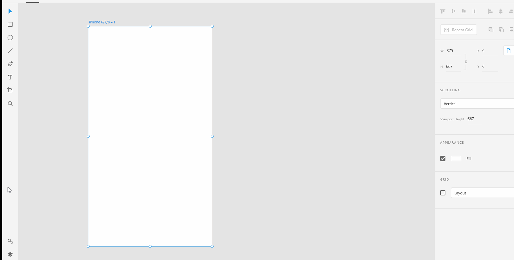
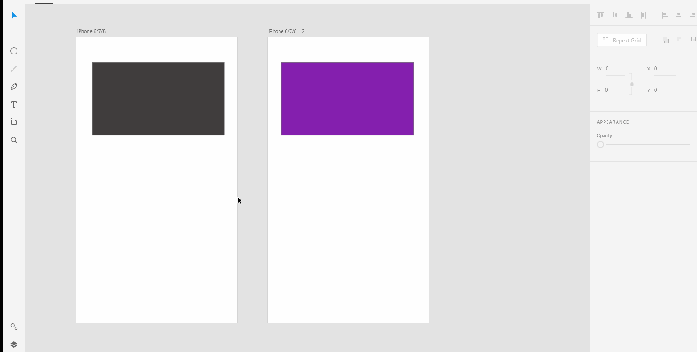

# **Work With Layers**

# **Experiment**

1. ### Similar to Illustrator and Photoshop. XD also has layers panel where you can see all your layers. But the layers panel has been designed with UX designers in mind thus it shows all yours artboards and you can double-click on an artboard to show all the layers associated with that particular artboard. 

2. ### To open the layers panel, you can either press `ctrl + Y` on Windows or `command + Y` on Mac or click the layers icon at the bottom left corner of the toolbar. 

3. ### Since the layers panel by default only shows the layers you've selected in a specific artboard, you need to go back in the layers panel main menu and double-click the artboard to show the layers in a different artboard.  

4. ### To find more options such as copy, paste and export, right-click on the artboards name in the layers panel. You can also do the same with the individual layers to get more layer options. 

## **Reference**

Adobe XD Guide
 
Source: https://helpx.adobe.com/xd/help/layers.html