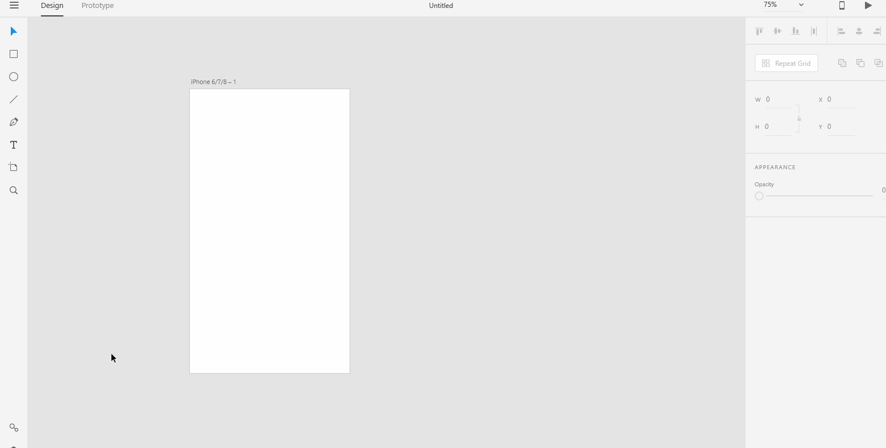

# **Manage Assets And Symbols**

# **Experiment**

1. ### The assets panel helps you organize frequently used assets and symbol in one place for quick reuse. To open the assets panel, click the assets panel icon or press `Command + Shift + Y (on Mac)` or `Ctrl + Shift + Y (on Windows)`. 

2. ### To reuse assets, you need to add assets to the assets panel. 

- To add colors and gradients, just click on the graphic objects that contains the color or gradient and select `+` on the Colors menu of the assets panel. 

- To add character styles, just click on the text box that contains the character style and select `+` on the Character Styles menu of the assets panel. 

3. ### You can apply the assets you've added to the assets panel to other graphic objects. To apply color or border for another graphic object, just click on the graphic object and right-click on Color and select "apply as fill" or "apply as border". To apply character styles, just click on the graphic object and click the character style from the assets panel. 

4. ### Symbols are icons, logo or any other visual element comprising of color, font, shape that you might use throughout your design. Symbols are a pretty nice way to organize assets that you will use again as it saves time rather than you having to import the assets each time you want to use them. Symbols are linked to one instance so if a instance of the symbol that you've added to the assets panel changes, all the other instances of that symbol changes as well. To add a symbol, click on the graphic object and press `Command + K(on Mac)` and `Ctrl + K(on Windows)` or select `+` on the symbols menu of the assets panel.  If you change one instance of a symbol, all the other instances changes. 

5. ### Once you add graphic objects to the assets panel, they become available for use to highlight and reverse-highlight on the canvas and on the assets panel respectively. To highlight and find assets on the canvas, right-click on the asset in the assets panel and select "highlight on canvas".  To reverse-highlight selections in the assets panel, right-click on the asset(either color, character style or symbol) in the artboard and select "reveal in assets". 

## **Reference**

Adobe XD Guide
 
Source: https://helpx.adobe.com/xd/help/assets-symbols.html