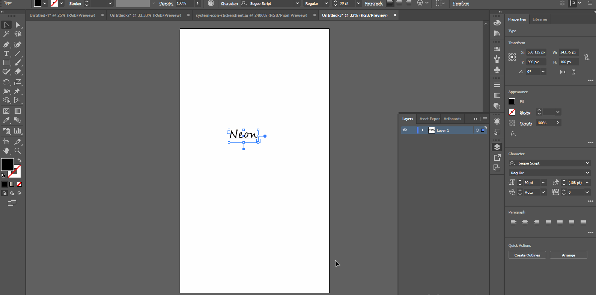
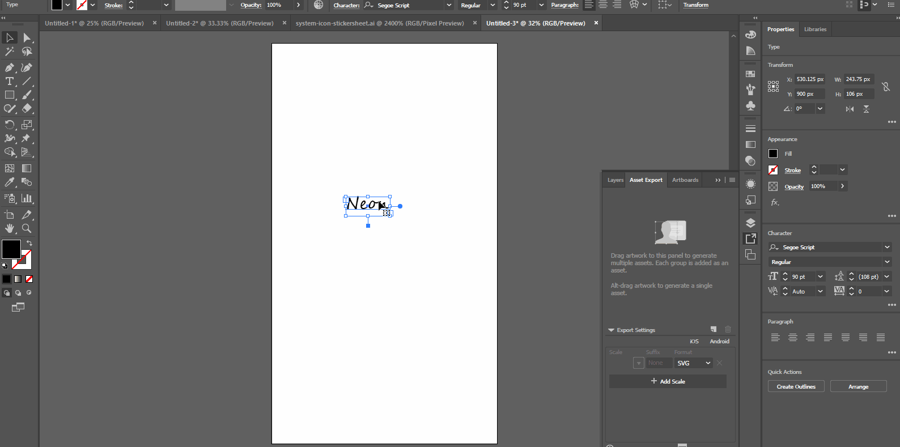

# **Work with External Assets**

# **Experiment**

1. ### Pretty much everything you do on Adobe XD should be focused on user experience design. All creative assets(all icons, graphic objects you might create or need) that you might use for your prototype should be imported from other softwares such as Adobe Photoshop, Adobe Illustrator or Sketch. For the most part, we would just use Adobe Illustrator to do our design. As you might probably know, Adobe XD must be in design mode to be able to import external assets. 

2. ### To import any graphic object from Adobe Illustrator: 

- ### you can just copy the graphic object in Illustrator and paste it in Adobe XD with the design mode toggled. The imported asset appears bigger compared to the version created in Illustrator. Note: if anyone figures out why, let me know. 

- ### Or you can export the graphic object as SVG file and import that svg file in Adobe XD using the import option under the hamburger menu. 

## **Reference**

Adobe XD Guide
 
Source: https://helpx.adobe.com/xd/help/working-with-external-assets.html