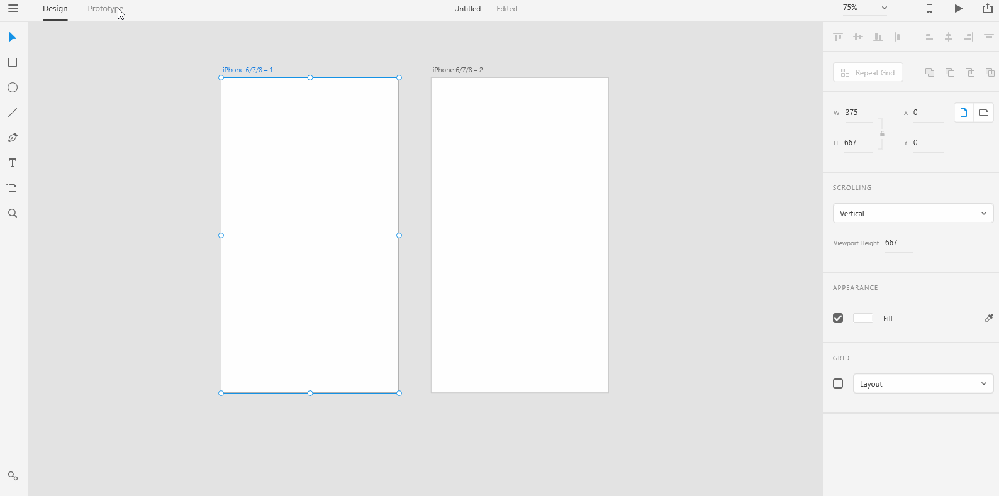
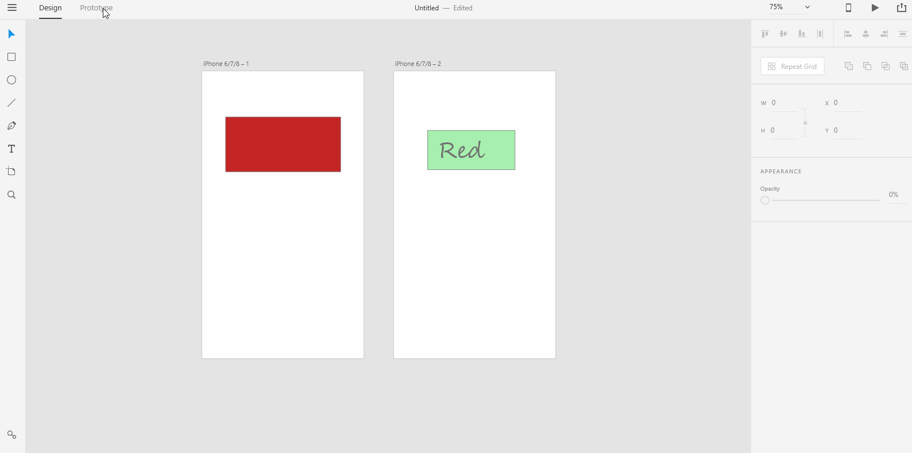

# **Create Prototypes**

# **Experiment**

1. ### Adobe XD lets you create interactive prototypes. You can design your screens and just wire the artboards together to create a prototype that looks pretty real when you see the prototype in a mobile device using Adobe XD app. Before we go further, it's good to remember that the prototype mode won't work until you have something on your artboard. If your artboard is empty, the prototype mode won't show anything.  

2. ### You would design the navigations between your screens by using the connecting handle that appears in prototype mode. Connect the wire to a graphic object in another artboard to create a story so to speak. What's the next scene in your story of an app or a website? Maybe in your app or website, the home screen scene is followed by a map or payment scene followed by a receipt scene. You can say all that using the connecting wires. You can connect the wires from artboards to artboards or from graphic element in one artboard to another artboard. 

3. ### Couple things to takeaway from this pilot is that, when you design your prototype you need to think of each screen in your prototype as a scene on a big movie. Movies typically consists of storyboards that say what comes next after a previous scene. Similar to that, in Adobe XD we have artboards. Each artboard should be thought of as a scene in a movie. The dialogues in this fictional(imagined) movie of ours is the intuitive(easy to understand) interactions between the user and the app or website. Just like a fiction writer that knows beforehand, what happens to what character in what time in the story, you need to put yourself in your user's shoes and try to imagine all scenarios that might occur to them as they use the app or website. 

## **Reference**

Adobe XD Guide
 
Source: https://helpx.adobe.com/xd/help/create-prototypes.html