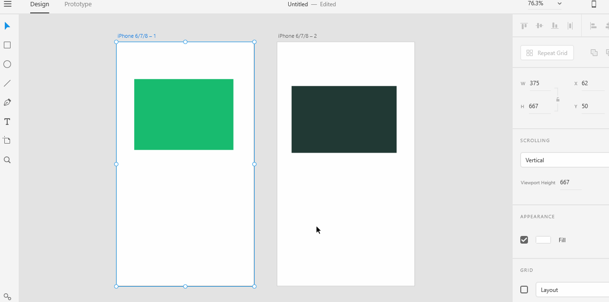

# **Set Home Screen**

## The Home screen is the first screen of your app or website. Your users begin to navigate the app or the website from the Home screen.

# **Experiment**

1. ### First create artboard and open an duplicate artboard with Alt+Left mouse button and drag it to right or left. Then click rectangle box and apply it on both the artboards and then it both with border colour and inner colour. 

2. ### Then click on prototype and select the artboard first which you want to apply as Homescreen. And click that wirring option and drag it to another artboard. 

3. ### Then click on that preview button to see that you worked on. 

# **Reference**

Adobe XD Guide

Source: "https://helpx.adobe.com/xd/help/create-prototypes.html"