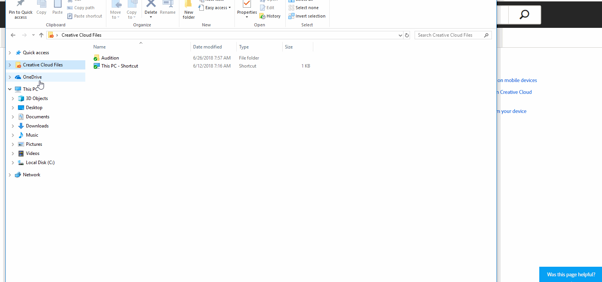
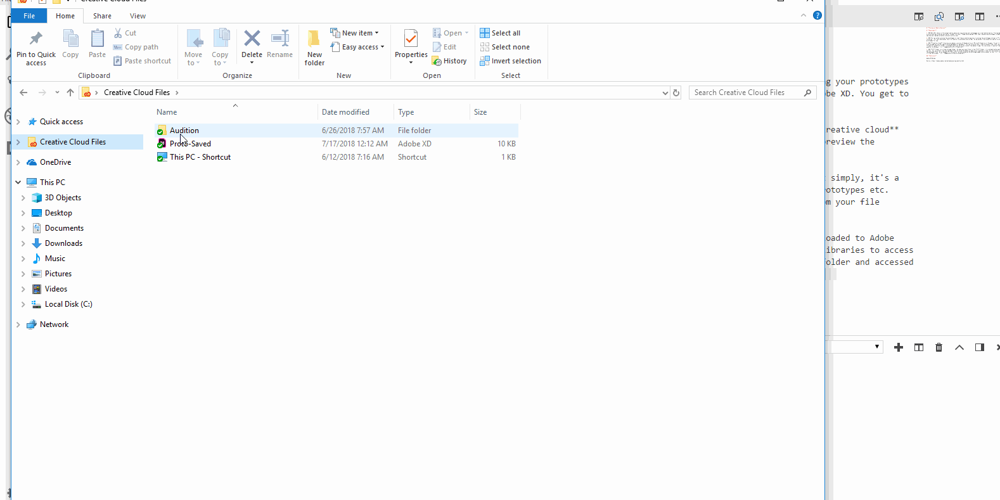
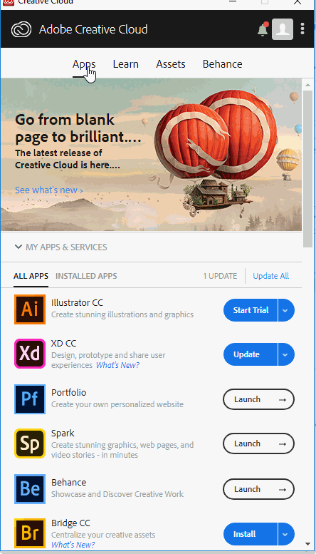

# **Preview on Mobile Devices**

# **Experiment**

1. ### With XD, there is this great option where you can preview your prototypes on a real mobile device. Previewing your prototypes on an actual device gives you better insight into your **experience design**(UX) than viewing the prototypes in Adobe XD. You get to see how your design actually interacts with a user. 

2. ### You can either preview the prototypes in real time on mobile devices or preview the prototypes stored in **creative cloud** libraries.  For the time being, the first option is available only on Mac. So we wouldn't be using this option to preview the prototypes for now. 

3. ### **Creative cloud** libraries are Adobe's version of Google drive or Microsoft Onedrive or Dropbox. To put it simply, it's a file storage service but specifically designed for designers. You can store all your creative assets like icons, prototypes etc. **Creative cloud**(CC) folder is automatically set up as you install the Adobe CC app. You can access it easily from your file explorer on Windows. 

4. ### **CC** folder is a cloud storage folder. That means you can save files in the **CC** folder and it's automatically uploaded to the **CC** libraries. Later on, you can either access the uploaded files easily by using the Adobe CC app, click Assets on the menu and click view on web or you can directly sign into the CC libraries from your favorite browser. As an example for this pilot, we have saved an XD prototype named "proto-saved" on the **CC** folder and accessed it from the Adobe CC app. 

5. ### Now that you have your prototype in the **CC** libraries, you can access the prototype from your mobile devices. Before you proceed, make sure you see **"all files up to date"** on **CC** app under Assets and you can see the prototype file when you access **CC** libraries either from your browser or from the CC app. This check is just to make sure that the files you're trying to preview has been uploaded to the **CC** libraries since you might be scratching your head otherwise.

6. ### Install the Adobe XD app on your mobile device, sign in to **CC** libraries and click **XD** documents to select the prototype file that you want to preview on your mobile device.  When you are previewing the prototype, the Adobe XD makes the preview look like a real app so to go back to **XD documents** or get menu options, you can long press anywhere on the preview. 

## **Reference**

Adobe XD Guide
 
Source: https://helpx.adobe.com/xd/help/preview-mobile.html