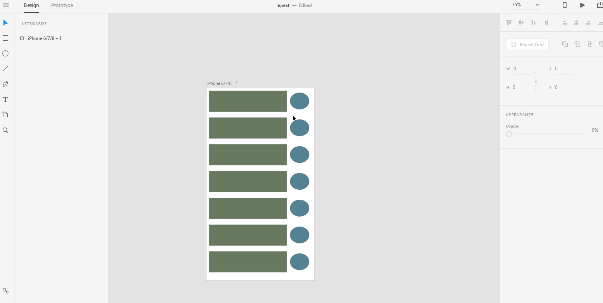

# **Create a Repeat Grid**

# **Experiment**

1. ### When you design in XD, there might come a time where you might want to create repeating graphic elements in your design. You can easily create repeating elements by using the repeat grid feature in the property inspector.  

2. ### To repeat a graphic object or objects, you need to first select all the objects you want to repeat. Click the repeat grid button in the property inspector, you would see two handles(horizontal and vertical), drag the handles in horizontal or vertical direction to create repeating elements that stretch out as far as you pull the handles. 

3. ### Most often you might want to edit the repeat grid that you have just created. You can double click a graphic object in the grid to start editing. Editing one instance(one thing out of a lot of same things) of a graphic object affects all the other instances in the grid. 

4. ### To edit a single instance without affecting all the other instances in the repeat grid, you need to first click the ungroup grid button in the property inspector which should be the visible right after you had used the repeat grid button. Once you've clicked the ungroup grid button, you can double click on a graphic object you want to edit to edit just that graphic object. 

## **Reference**

Adobe XD Guide
 
Source: https://helpx.adobe.com/xd/help/create-repeating-elements.html