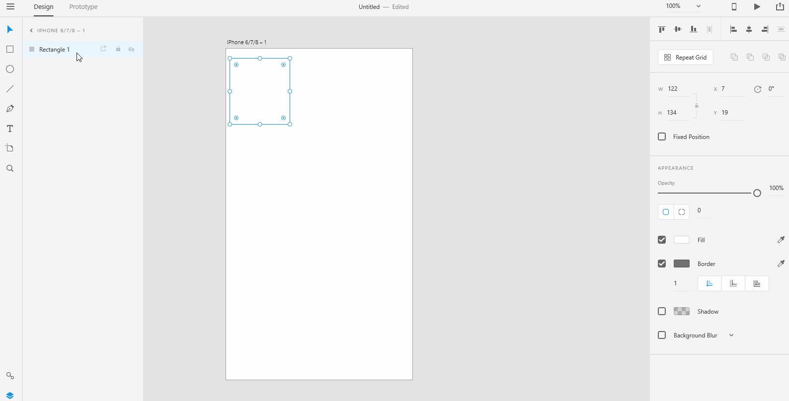
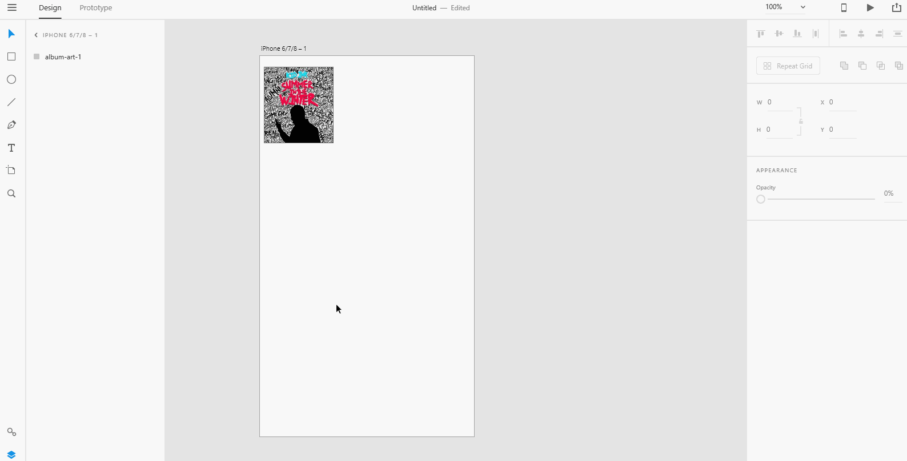

# **Work with Images in Repeat Grid**

# **Experiment**

1. ### With XD, you can easily create repeating image elements in your prototype. Once you create a repeat grid with the image fill(places in your app where you show images) selected, you can just drag the image and drop it on the image fill. Image fills can be any graphic shape object like rectangle or circle. 

2. ### To replace an image, just drag and drop the new image that you want to fill. 

3. ## In a repeat grid, you can drag and drop the images by selecting all the images or you can fill the images one-by-one individually. 
 

4. ### If the number of images that you drag and drop is less than the image fills available in your repeat grid, the image order repeats. See the above #3 gif where there are three images for four image fills in the repeat grid. Hence, the first one is repeated in the fourth image fill.

## **Reference**

Adobe XD Guide
 
Source: https://helpx.adobe.com/xd/help/create-repeating-elements.html

