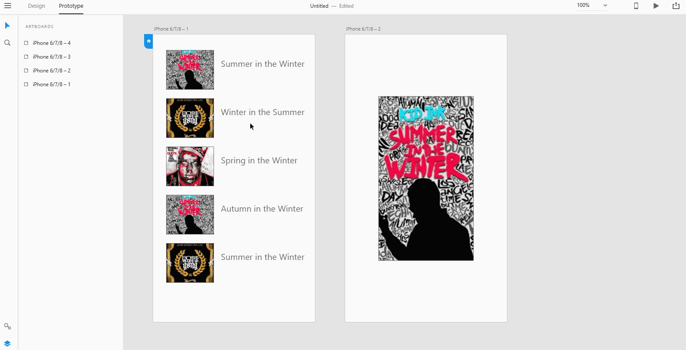
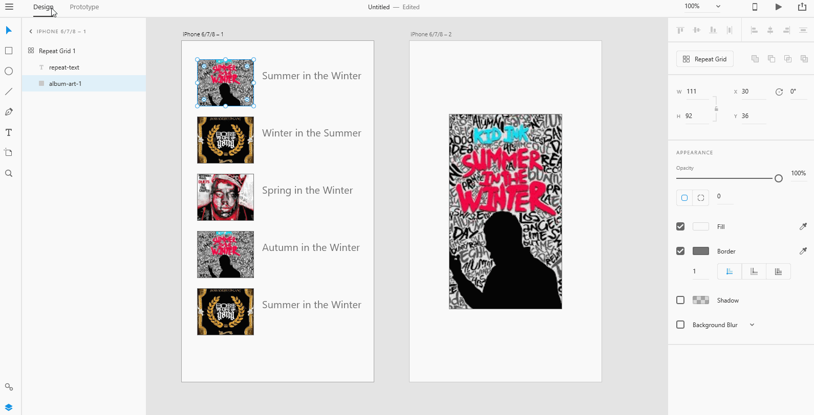

# **Create Interactions from Repeat Grid**

# **Experiment**

1. ### There are three ways you can wire interactions from a repeat grid to other artboards: 

- ### You can wire the entire repeat grid to other artboards. 

- ### You can wire a single element in your repeat grid to other artboards by double-clicking on the specific element you want to create interactions from.

- ### You can also group elements in your repeat grid and wire that group object to other artboards. Select the object you want to wire interactions and shift-select all the other objects you want to put in the group. Right click on the selected objects and select the group option. Then wire the group object to other artboards. 

## **Reference**

Adobe XD Guide
 
Source: https://helpx.adobe.com/xd/help/create-repeating-elements.html