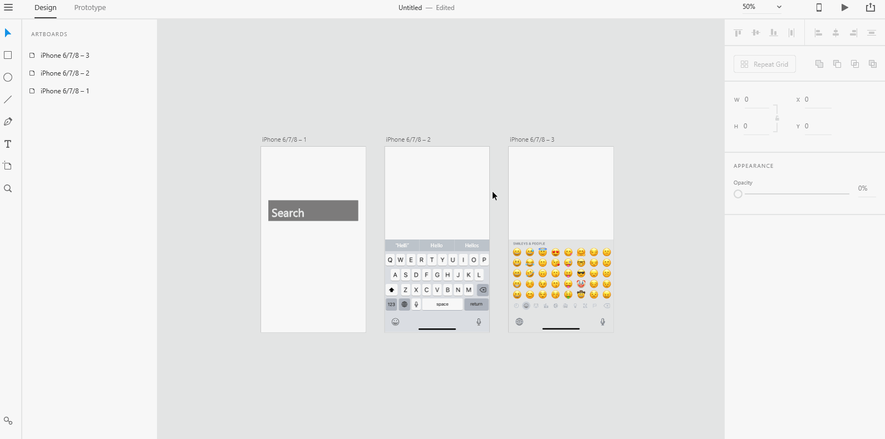
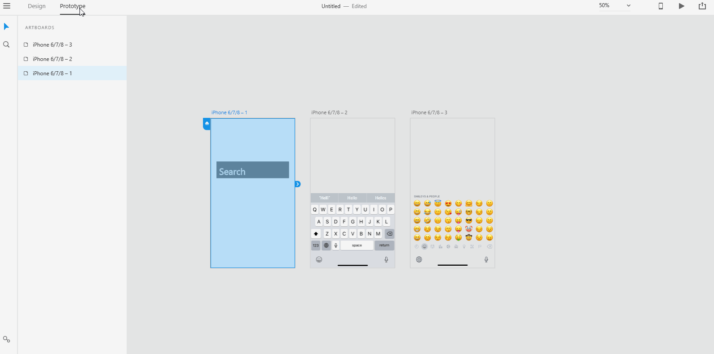

# **Overlay Support**

# **Experiment**

1. ### With overlay support, you can create menu dropdowns, keyboards that "slide up" and lightboxes (images that blur out the surrounding, see this image to get a sense of them: https://en.wikipedia.org/wiki/Lightbox_(JavaScript)#/media/File:Lightbox_mockup.jpg)

2. ### In design mode, create two artboards: 

- ### The artboard that wires to the overlay artboard.

- ### The overlay artboard that stacks up on the linking artboard.

3. ### If the overlay graphic element doesn't appear in prototype mode, create a new artboard and keep the graphic element in it. 

4. ### In prototype mode, wire the artboard to the overlay, select the overlay option next to transition option. Select the transition and easing of your choice.

## **Reference**

Adobe XD Guide
 
Source: https://helpx.adobe.com/xd/help/whats-new.html#Overlay