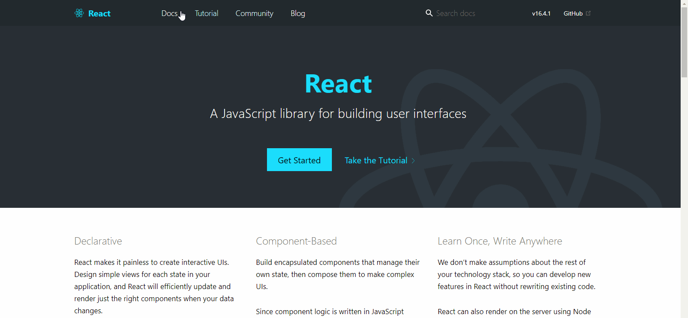
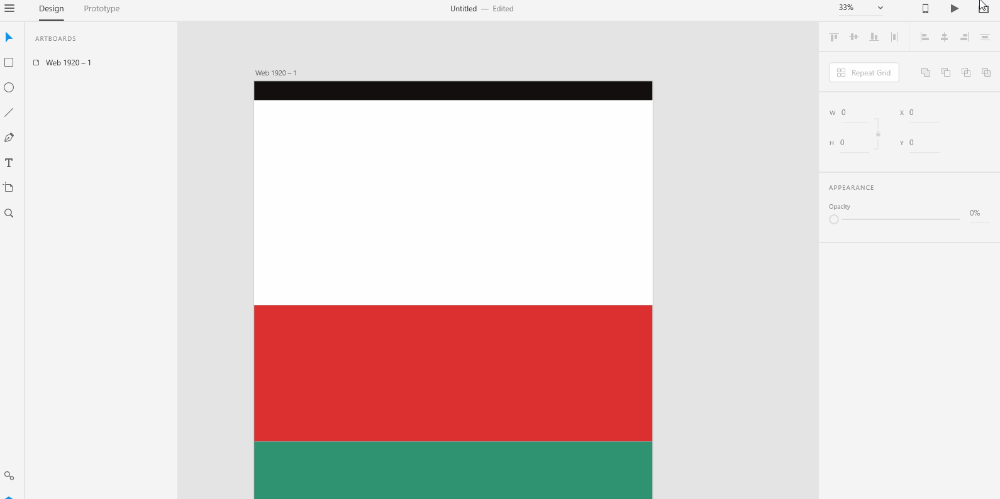

# **Fixed Elements In Prototype**

# **Experiment**

1. ### Fixed elements feature is a familiar effect for most browser users. The effect fixes the navigation bar as you scroll down the webpage. 

2. ### To achieve the fixed elements effect in your prototypes, create a scrollable artboard. Then, select the element you want to fix to the screen and select fixed position option from the property inspector.

## **Reference**

Adobe XD Guide
 
Source: https://helpx.adobe.com/xd/help/whats-new.html#FixedElements

